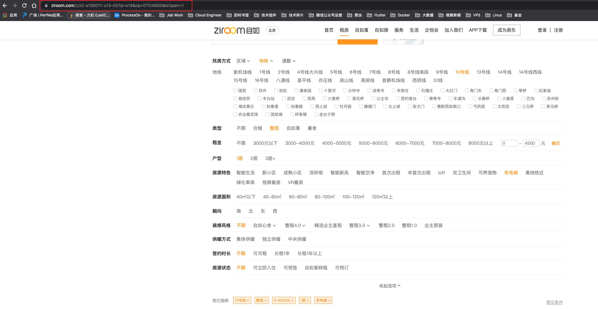

## 自如新房源实时提醒

> 利用自如网页版查询房源，解析HTML并分析房源，找到新上架房源并推送至钉钉群。

1. 首次初始化加载所选链接的所有房源（不通知）
2. 等待下次任务调度，调度周期时间由`taskInterval`控制
3. 执行任务，拿到最新房源数据，与上次房源集合进行比对
4. 已存在房源pass，新房源通知钉钉

#### 第一步：通过自如网页版本过滤条件并获取URL链接



#### 第二步：运行GO程序

> 需自行编译（参考Golang交叉编译）。使用命令可参考：ziroom --help，查看提示信息。


```shell script
┌─[uzdz@uzdz] - [~/work/golang/ziroom] - [Tue Jul 06, 14:19]
└─[$] <git:(master*)> go run main.go --help                                                                                                                                                                                              
usage: main [<flags>] [<url>]

Flags:
      --help              Show context-sensitive help (also try --help-long and --help-man).
  -d, --ding=DING         钉钉消息通知接口地址
  -k, --dingKey="自如"      钉钉消息通知授权KEY（白名单）
  -p, --taskInterval=300  任务周期间隔时长（最少5分钟），单位：秒

Args:
  [<url>]  自如网页版请求链接
```

将从自如拿到的请求URL带入到参数末尾即可，以下进行举例：

* linux_ziroom --ding='https://oapi.dingtalk.com/robot/send?access_token=xxx' --dingKey=xxx 'https://www.ziroom.com/z/z2-s100011-u13-r0/?p=x14&cp=0TO4500&isOpen=1'

#### 第三步：钉钉通知


## License

This project is licensed under the [Apache v2.0 License](https://github.com/apache/skywalking-cli/blob/master/LICENSE).

## 免责声明

此软件程序用于替代人工耗时的检索房源过程，请勿修改代码中的网站保护策略。知法懂法，请参考[破坏计算机信息系统罪](https://www.66law.cn/zuiming/276.aspx)。